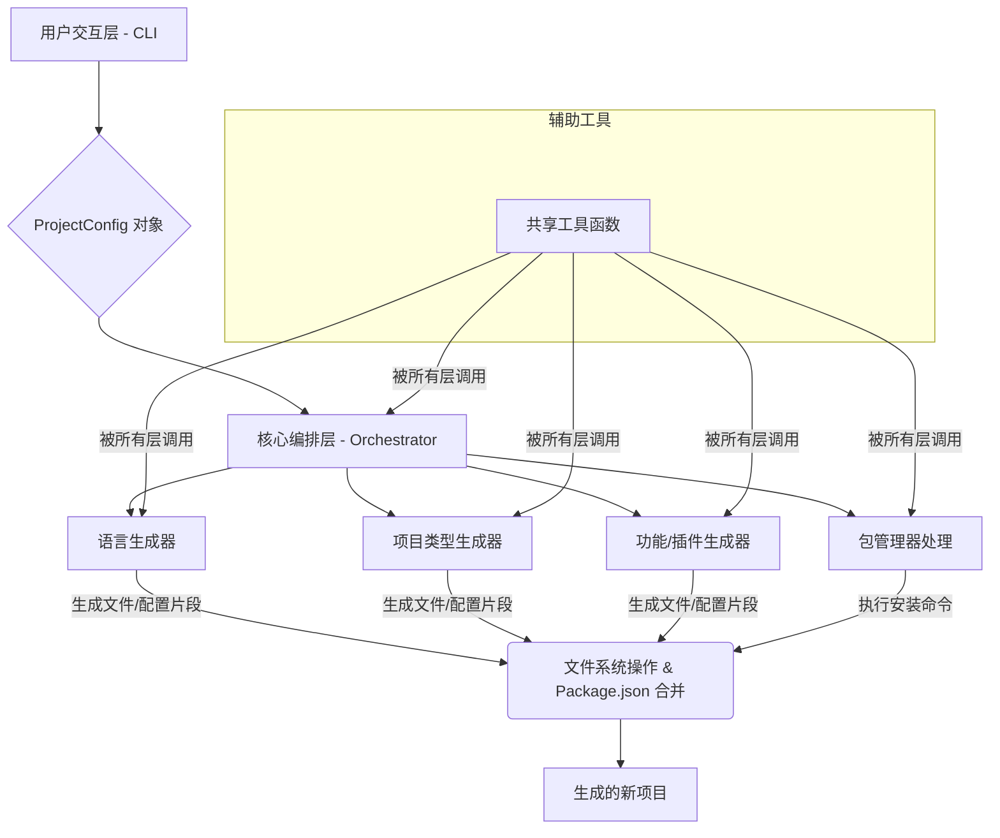

## 1. 项目愿景 (长远目标)

构建一个统一的、高度可配置的、构建工具与框架解耦的前端/后端项目脚手架。通过一个统一的命令行入口，允许开发者选择不同的框架（Vue, React, Svelte, Solid, Nuxt, Next, 纯 Node.js + TS 等）、构建工具（Vite, Webpack, Rspack, Turbopack 等）、包管理器（npm, pnpm, yarn, bun）、以及各种预置依赖和插件（ESLint, Prettier, Tailwind CSS, UnoCSS 等），快速生成符合最佳实践的新项目。

## 2. MVP 目标

本阶段 MVP 的目标是实现一个能够生成**通用 JavaScript/TypeScript Node.js 库项目**的 CLI 工具。具体功能包括：

* **项目类型：** 纯 Node.js 库 (非前端框架)。
* **语言选择：** JavaScript 或 TypeScript。
* **包管理器选择：** npm, pnpm, yarn, bun。
* **可选功能：** ESLint、Prettier。
* **默认配置：** 生成基础的 `package.json`、`src/index.ts` (或 `.js`)、`.gitignore`、`README.md`。
* **编译 (针对 TS)：** 使用 TypeScript 官方编译器 `tsc`。

## 3. 核心设计原则

* **模块化与可组合性：** 将项目创建过程拆分为独立的、可插拔的模块（如语言模块、项目类型模块、功能模块），每个模块负责其特定领域的生成逻辑。
* **配置驱动生成：** 整个生成过程由一个统一的 `ProjectConfig` 对象驱动，该对象包含了用户所有的选择。
* **动态文件生成：** 尽可能通过代码逻辑动态生成配置文件和代码，而不是依赖大量的静态模板，以适应复杂的组合需求。
* **显式副作用管理：** 明确区分纯逻辑（数据转换、配置生成）和副作用（文件系统操作、命令行交互），提高代码的可测试性和可维护性。
* **分层抽象：** 针对不同的领域（语言、项目类型、构建工具、功能等）进行层次化抽象，降低模块间的耦合度。

## 4. 整体架构概览

整个 CLI 工具将采用分层架构，从用户交互到最终的文件生成，职责清晰。



## 5. 详细组件设计

### 5.1. 用户交互层 (CLI)

* **位置：** `src/cli/`
* **职责：**
  * 解析命令行参数（如 `pnpm create my-lib --type node-lib`）。
  * 通过交互式提示 (`prompts`) 收集用户输入，引导用户完成各项选择。
  * 构建并返回一个完整的 `ProjectConfig` 对象。
* **核心模块：**
  * `src/cli/index.ts`: CLI 入口，处理命令行参数，调用 `prompts` 收集信息。
  * `src/cli/questions.ts`: 定义所有交互式问题的集合。
* **关键技术：** `cac` (命令行参数解析), `prompts` (交互式提示), `kolorist` (美化输出)。

### 5.2. 核心编排层 (Orchestrator)

* **位置：** `src/core/`
* **职责：**
  * 接收由用户交互层生成的 `ProjectConfig` 对象。
  * 根据 `ProjectConfig`，协调并调用各个**生成器模块**来执行文件生成、依赖收集等任务。
  * 管理项目目录的创建和初始化。
  * 合并所有生成器返回的 `package.json` 片段（依赖、脚本等）。
  * 最后调用包管理器进行依赖安装。
  * 处理整个过程中的错误。
* **核心模块：**
  * `src/core/types.ts`: 定义 `ProjectConfig` 接口。
  * `src/core/orchestrator.ts`: 核心协调逻辑，定义生成步骤的顺序。
  * `src/core/context.ts`: 用于在生成器之间共享一些运行时状态或配置，例如生成的 `package.json` 对象，方便各生成器对其进行修改。
* **关键流程：**
    1. 创建项目根目录。
    2. 初始化 `package.json` 对象（名称、版本等）。
    3. 调用 **语言生成器**。
    4. 调用 **项目类型生成器** (Node.js Lib)。
    5. 调用 **功能生成器** (ESLint, Prettier)。
    6. 将所有生成器收集到的依赖和脚本合并到 `package.json` 中。
    7. 写入所有文件到项目目录。
    8. 调用 **包管理器处理模块** 安装依赖。
    9. 执行其他初始化操作（如 `git init`）。

### 5.3. 生成器模块 (Generators)

这些是实现“抽象”的核心。每个生成器模块都将接收 `ProjectConfig`，并负责生成其对应的文件内容、修改 `package.json` 信息等。

#### 5.3.1. 语言生成器 (Language Generator)

* **位置：** `src/generators/language/`
* **职责：** 根据 `ProjectConfig.language` 决定项目使用的语言，并生成相应的配置文件和文件后缀。
* **核心模块：**
  * `src/generators/language/index.ts`:
    * `generateLanguageConfig(config: ProjectConfig, context: ProjectContext)`:
      * 如果选择 TypeScript，生成 `tsconfig.json` 文件内容。
      * 决定后续文件生成时应使用的文件后缀 (`.ts` 或 `.js`)。
      * 向 `context.pkg` (即 `package.json` 对象) 添加 `devDependencies` (如 `typescript`, `@types/node`) 和 `scripts` (如 `build: "tsc"`)。
* **耦合点：** 它的输出（如 `tsconfig.json` 和文件后缀）会影响几乎所有其他生成器。

#### 5.3.2. 项目类型生成器 (Project Type Generator)

* **位置：** `src/generators/projectType/` (MVP 阶段只有 `nodeLib.ts`)
* **职责：** 生成所选项目类型（本阶段为 Node.js 库）的基础结构和文件。
* **核心模块：**
  * `src/generators/projectType/nodeLib.ts`:
    * `generateNodeLib(config: ProjectConfig, context: ProjectContext)`:
      * 生成 `src/index.ts` (或 `.js`) 文件内容。
      * 生成 `.gitignore`、`README.md` 文件内容。
      * 向 `context.pkg` 添加 `main`, `types` (如果 TS), `files` 等 `package.json` 字段。
* **耦合点：** 需要 `ProjectConfig.language` 来决定 `src/index` 的文件后缀。

#### 5.3.3. 功能生成器 (Feature Generators)

* **位置：** `src/generators/features/`
* **职责：** 根据 `ProjectConfig.features` 中的选择，生成特定功能（如 ESLint, Prettier）的配置文件，并添加相应的依赖和脚本。
* **核心模块：**
  * `src/generators/features/eslint.ts`:
    * `generateEslint(config: ProjectConfig, context: ProjectContext)`:
      * 生成 `.eslintrc.cjs` 文件内容。这个内容需要根据 `config.language` (是否需要 `@typescript-eslint/parser`) 和 `config.projectType` (未来可能用于特定规则) 进行动态调整。
      * 向 `context.pkg` 添加 ESLint 相关的 `devDependencies` (`eslint`, `@typescript-eslint/parser`, `eslint-plugin-promise` 等) 和 `scripts` (如 `lint`)。
  * `src/generators/features/prettier.ts`:
    * `generatePrettier(config: ProjectConfig, context: ProjectContext)`:
      * 生成 `prettier.config.js`、`.prettierignore` 文件内容。
      * 向 `context.pkg` 添加 Prettier 相关的 `devDependencies` (`prettier`) 和 `scripts` (如 `format`)。
* **耦合点：** 需要 `ProjectConfig.language` 来生成适配不同语言的配置。

### 5.4. 包管理器处理 (Package Manager Handler)

* **位置：** `src/handlers/packageManager/`
* **职责：** 根据 `ProjectConfig.packageManager` 执行相应的依赖安装命令。
* **核心模块：**
  * `src/handlers/packageManager/index.ts`:
    * `installDependencies(config: ProjectConfig, projectDir: string)`:
      * 根据 `config.packageManager` 选择执行 `npm install`、`pnpm install`、`yarn install` 或 `bun install`。
* **关键技术：** `execa` (执行外部命令)。

### 5.5. 共享工具函数 (Utilities / Shared Services)

* **位置：** `src/utils/`
* **职责：** 提供所有模块都可能用到的通用辅助函数，提高代码复用性。
* **核心模块：**
  * `src/utils/fs.ts`: 封装 `fs-extra`，提供更高级的文件操作（如 `copyFile`, `writeFile`, `ensureDir`）。
  * `src/utils/packageJson.ts`: 提供 `deepMergePackageJson` 函数，用于合并各个生成器提供的 `dependencies`, `devDependencies`, `scripts` 等。
  * `src/utils/logger.ts`: 封装 `kolorist`，提供统一的日志输出函数（信息、警告、错误）。
  * `src/utils/template.ts`: 一个简单的模板渲染器，用于处理少量变量替换的静态模板文件（如 `README.md`）。
  * `src/utils/path.ts`: 处理路径相关的跨平台兼容性问题（可选 `pathe`）。

## 6. 高级文件结构 (High-Level File Structure)

```
my-universal-cli/
├── src/
│   ├── cli/                   // 用户交互和命令行解析
│   │   ├── index.ts           // CLI 入口
│   │   └── questions.ts       // 定义交互式问题
│   │
│   ├── core/                  // 核心编排逻辑
│   │   ├── index.ts           // Orchestrator 主体
│   │   ├── types.ts           // ProjectConfig 和 ProjectContext 定义
│   │   └── context.ts         // 项目上下文，用于共享状态
│   │
│   ├── generators/            // 各个抽象层次的生成器模块
│   │   ├── language/          // 语言抽象 (JS/TS)
│   │   │   └── index.ts
│   │   │
│   │   ├── projectType/       // 项目类型抽象 (MVP: Node.js Lib)
│   │   │   └── nodeLib.ts
│   │   │   └── index.ts       // 导出所有项目类型生成器
│   │   │
│   │   └── features/          // 可选功能/插件抽象 (ESLint, Prettier)
│   │       ├── eslint.ts
│   │       ├── prettier.ts
│   │       └── index.ts       // 导出所有功能生成器
│   │
│   ├── handlers/              // 处理副作用的模块
│   │   └── packageManager/    // 包管理器操作
│   │       └── index.ts
│   │
│   └── utils/                 // 共享工具函数
│       ├── fs.ts
│       ├── logger.ts
│       ├── packageJson.ts
│       ├── template.ts
│       └── path.ts
│
├── templates/                 // 少量静态模板（例如 README.md, .gitignore 的通用部分）
│   ├── common/
│   │   ├── _gitignore          // 文件名前缀下划线表示需要重命名
│   │   └── README.md.ejs
│   └── node-lib/
│       └── src/
│           └── index._lang_.ejs // _lang_ 占位符用于根据语言选择 .ts 或 .js
│
├── package.json
├── tsconfig.json
└── README.md
```

## 7. MVP 工作流示例

假设用户运行 `pnpm create my-node-lib`，并选择：

* 项目名称：`my-node-lib`
* 项目类型：`Node.js Library` (默认或唯一选项)
* 语言：`TypeScript`
* 包管理器：`pnpm`
* 启用 ESLint：`Yes`
* 启用 Prettier：`Yes`

1. **用户交互层**：
    * `cli/index.ts` 捕获 `my-node-lib` 作为项目名。
    * `cli/questions.ts` 定义的问题通过 `prompts` 呈现给用户。
    * 收集所有输入，形成 `ProjectConfig` 对象。

2. **核心编排层** (`core/orchestrator.ts`)：
    * 接收 `ProjectConfig`。
    * 在当前目录下创建 `my-node-lib` 目录。
    * 初始化一个空的 `package.json` JavaScript 对象 (`context.pkg`)。
    * 调用 **语言生成器**：
        * `generators/language/index.ts` 根据 `config.language === 'typescript'` 生成 `tsconfig.json` 的内容。
        * 将 `typescript`, `@types/node` 添加到 `context.pkg.devDependencies`。
        * 将 `"build": "tsc"` 添加到 `context.pkg.scripts`。
    * 调用 **项目类型生成器**：
        * `generators/projectType/nodeLib.ts` 根据 `config.language === 'typescript'` 生成 `src/index.ts` 的内容。
        * 生成 `.gitignore` 和 `README.md` 的内容（可能使用 `template.ts` 渲染）。
        * 将 `main`, `types` 字段添加到 `context.pkg`。
    * 调用 **功能生成器**：
        * `generators/features/eslint.ts` 根据 `config.language` 生成 `.eslintrc.cjs` 的内容 (包含 TypeScript 解析器)。
        * 将 ESLint 相关依赖和 `lint` 脚本添加到 `context.pkg`。
        * `generators/features/prettier.ts` 生成 `prettier.config.js` 和 `.prettierignore` 的内容。
        * 将 Prettier 相关依赖和 `format` 脚本添加到 `context.pkg`。
    * **文件写入**：`core/orchestrator.ts` 收集所有待写入的文件内容和路径，通过 `utils/fs.ts` 写入到 `my-node-lib/` 目录下。
    * **`package.json` 最终化**：`core/orchestrator.ts` 将 `context.pkg` 对象转换为 JSON 字符串并写入 `my-node-lib/package.json`。
    * **依赖安装**：调用 `handlers/packageManager/index.ts`，执行 `pnpm install` 命令。

## 8. 未来扩展性考量

* **新的项目类型：** 可以在 `src/generators/projectType/` 下添加 `reactApp.ts`, `vueApp.ts` 等模块。
* **新的构建工具：** 可以在 `src/generators/buildTools/` 下添加 `vite.ts`, `webpack.ts`, `rspack.ts` 等模块，这些模块将负责生成各自的配置文件，并修改 `package.json` 的 `scripts` 和 `devDependencies`。
* **新的功能/插件：** 可以在 `src/generators/features/` 下继续添加 `tailwind.ts`, `unocss.ts`, `router.ts` 等。它们可能需要修改已生成的其他文件（如 `vite.config.ts` 中的插件配置），这需要 Orchestrator 提供适当的后处理钩子或上下文共享机制。

这个架构提供了一个清晰的起点。通过先实现 MVP，您将能够验证核心的“抽象”和“组合”理念，并为未来的复杂功能打下坚实的基础。期待您的这个项目！
